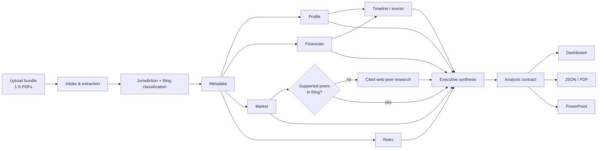

# FilingLens architecture

## Design objective

FilingLens is a filing-first analysis system, not a general-purpose research agent. Regulatory documents are the authority for issuer facts and financials. External web research is an explicitly bounded enrichment layer and may not overwrite filing-derived facts.

The product is organized around three independent concerns:

1. **Evidence acquisition** — PDF extraction, filing classification and section-aware retrieval.
2. **Analysis pipeline** — bounded specialist modules with explicit dependencies and failure semantics.
3. **Presentation** — dashboard, JSON/PDF export and PowerPoint generated only from the assembled analysis contract.

## Runtime flow

## Dependency-aware execution

The browser orchestrator follows a bounded DAG rather than treating every module as an unrelated sequential call:

| Phase | Stages | Mechanics |
| --- | --- | --- |
| 1. Intake | extract, classify, metadata | Mandatory and sequential |
| 2. Core evidence | profile, financials, market, risks | Maximum 2 concurrent model requests |
| 3. Validation/enrichment | timeline, conditional peer research | Runs after required core context is available |
| 4. Synthesis | executive synthesis | Runs after all available upstream results settle |
| 5. Presentation | dashboard binding, exports | Deterministic; no new analytical claims |

The concurrency ceiling is deliberate. It reduces end-to-end latency without recreating the provider saturation and retry amplification caused by broad parallel agent fan-out.

## Retrieval architecture

Every PDF remains an independent retrieval unit inside a bundle. Long filings are not truncated from the front only. FilingLens retrieves several evidence windows per relevant section family:

- SEC financial statements: Part I Item 1, condensed income statements, balance sheets, cash flows and Item 8 for annual filings.
- SEC market/segment evidence: segment notes, geographic information, MD&A, Item 1 Business and Exhibit 99.1.
- SEC risk evidence: Item 1A and explicit risk-update language.
- CVM equivalents: DFP/ITR financial statements, segment disclosures, risk sections and market sections.
- Event evidence: 8-K/Fato Relevante references and subsequent-event sections.

Evidence budgets are divided proportionally across documents, preventing one large filing from starving later documents in a bundle.

## Provenance contract

Each material claim should resolve to one of two source types:

- `excerpt`: evidence from an uploaded filing, including section/item/page where available.
- `citation`: an independently cited external URL returned by the research provider.

External sources are currently allowed only for bounded peer/timeline enrichment. They do not replace filing-derived financial statements.

## Module states

The UI exposes operational state, not hidden model reasoning.

- **Complete** — module returned useful data meeting filing-type completeness rules.
- **Partial** — useful output exists but one or more expected fields are unavailable.
- **Not applicable** — the filing type does not reasonably contain that data class.
- **Failed** — the module did not return usable output after bounded attempts.
- **Skipped** — a conditional stage was unnecessary.

A partial result is not equivalent to a system error. Dashboard empty states must identify whether data was not disclosed, not applicable, or unavailable due to execution failure.

## Failure and retry policy

- Provider/configuration/policy errors are terminal and are not retried as transient outages.
- Timeouts and genuine transient 5xx failures get at most one fresh browser retry.
- A specialist failure degrades that module while preserving other completed modules.
- Invalid schemas or deterministic validation errors are treated as product defects, not retryable outages.
- Web enrichment failure never discards filing-derived market analysis.

## Analysis contract

All presentation surfaces consume the same `FilingAnalysis` contract in `contracts/analysis.ts`. The dashboard and exports may reformat, filter or visualize the contract but must not introduce unsupported facts.

## UI architecture

The v2 interface exposes the pipeline in four human-readable phases:

1. Read & classify
2. Extract evidence
3. Validate & enrich
4. Synthesize & publish

The dashboard then prioritizes:

1. issuer identity and period;
2. coverage/quality state;
3. headline KPIs and executive summary;
4. financials, market, risks and events;
5. provenance and missing-data detail.

This hierarchy is intentional: users should understand whether an analysis is trustworthy before interpreting its charts.

## PowerPoint generation

The PowerPoint renderer is deterministic and generated from the same `FilingAnalysis` contract. OOXML identifiers and package relationships must comply with Microsoft Office constraints. Presentation generation has a dedicated regression test so an export may not be marked ready if its package contract is invalid.
