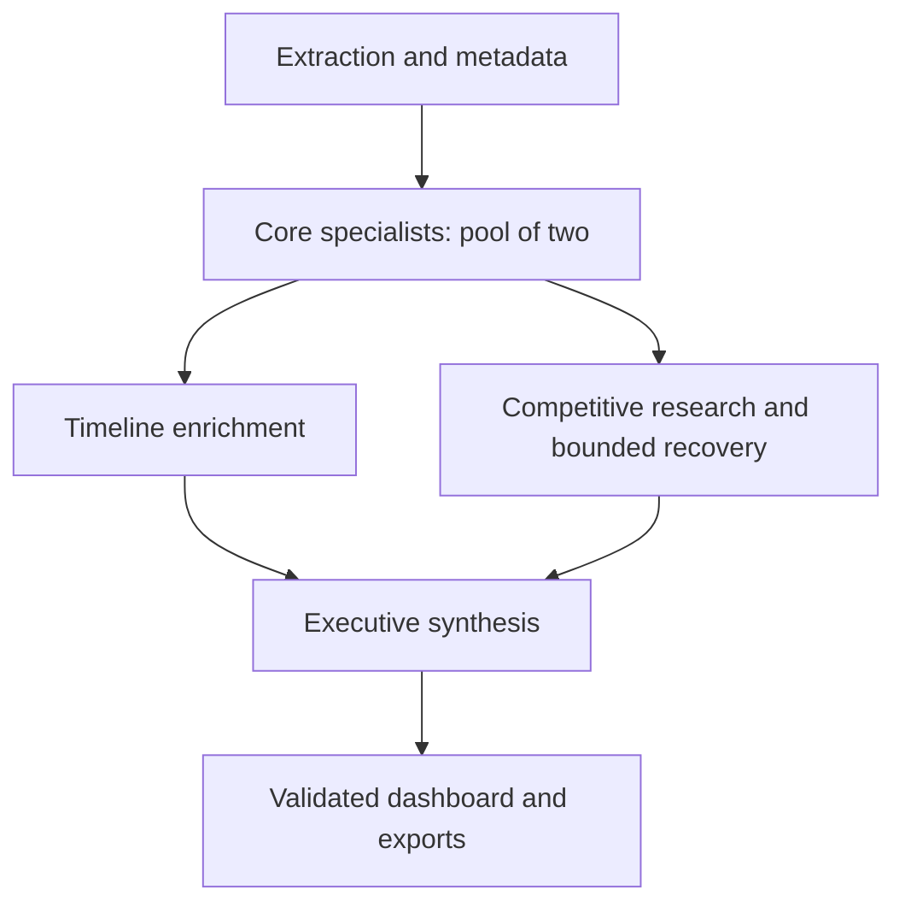

# FilingLens: bounded specialist execution

## 1. Dependency mapping and risk analysis

The goal is reliable filing-first analysis with the existing six specialists. The browser owns the workflow; the Node API owns provider admission, deadlines and request-local budgets. Uploaded filings and web output are untrusted evidence, not instructions or permission grants. Existing citation binding and financial validation remain the authority for contract assembly.

Verified in the checkout: ordinary `generateObject` calls omitted `maxRetries`, server generation timeouts were 300 seconds, browser deadlines were 150–240 seconds, and concurrency was limited only per browser. The installed AI SDK defaults omitted retries to two (`node_modules/ai/src/util/prepare-retries.ts`; [SDK settings](https://ai-sdk.dev/docs/ai-sdk-core/settings)). Thus a nominal two-attempt browser policy could issue up to six provider attempts for one ordinary stage (modeled upper bound).

Railway inspection showed the main service and data-tools service running on one replica each; main-service tracing was disabled. A valuation preview separately reported a crashed replica despite an Online summary. Logs showed incomplete 10-Q financials, a structured-output failure, and competitive research recovering five verified peers from six citations after the first response had no citations. These observations demonstrate a working recovery path, not production reliability or financial completeness.

Highest-impact risks: retry multiplication, cross-user provider saturation, abandoned work after browser timeout, payload exposure in SDK exception logs, and treating partial evidence as complete. This increment addresses execution controls and logging. Extraction quality and ground-truth completeness require a separate labeled benchmark.

## 2. Architecture proposals

| Candidate | Feasibility and workflow | Cost per execution | Latency and critical path | Risk controls and proof | Prefer when |
| --- | --- | --- | --- | --- | --- |
| A: existing browser DAG with API admission (selected) | Fits current endpoints and typed contracts; retains six specialists and deterministic validators | Normal path: 8 SDK generations (metadata, six specialists, one competitive generation); up to 11 with focused risk recovery and two competitive recovery generations, before browser retries. Multi-step web generations can contain several provider calls. Report actual usage rather than invent dollar prices | Metadata + two-worker core makespan + max(timeline, research) + synthesis, plus regulatory lookup and deterministic binding. Queueing adds at most 10 seconds per admission; no p50/p95 prediction without measurements | One process-wide gate, request deadline, bounded recovery, no SDK retries, explicit partial outcomes. Unit/fault-injection and local build checks | Current single-replica service; smallest reviewable improvement |
| B: durable server-owned DAG with persisted jobs | Requires job ownership, upload/evidence persistence, authenticated run identity, resume/status endpoints and a worker deployment | Similar model work for equivalent evidence tasks; adds durable storage/queue cost and recovery overhead, but can prevent duplicate submissions through idempotency | Same analytical critical path; adds job queue delay, allows browser-independent continuation and reliable cancellation state | Persist state transitions, deduplicate stages, enforce full-run budgets across retries, test crash/restart and resumed synthesis | Measured duplicate billing, disconnect losses or queue pressure justify infrastructure |

Both candidates preserve specialist schema checks and citation validators. Compare them on the same inputs, configured models and token budgets. Neither additional specialists nor a debate/swarm is justified by the observed execution-control defects. A generator–critic stage would add calls without a calibrated rubric and ground truth.

## 3. Comparative pros and cons

| Dimension | Previous baseline | Candidate A | Candidate B |
| --- | --- | --- | --- |
| Workflow fit | Already matches dependencies | Same DAG; focused boundary changes | Same DAG; substantial orchestration migration |
| Quality/coverage | Validators exist; measured incomplete modules | Preserves validators; quality improvement is unproven | Resume may preserve completed work; quality improvement is unproven |
| Cost | Modeled retry amplification: up to 6 provider attempts per ordinary stage | At most 2 browser attempts per ordinary stage; SDK retries disabled | Can deduplicate attempts, but adds infrastructure cost |
| Latency | Server can outlive browser deadline | Model/HTTP work uses shorter shared request deadlines; saturation is rejected early | Durable queue may increase wait while improving recovery |
| Operability | Browser concurrency; unstructured errors | Two concurrent generations per Node process; sanitized correlation logs | Durable state and full-run governance |
| Complexity | Existing code | Small increment; no new services or dependencies | Higher implementation and operational burden |

Resource counts are modeled; controls are verified by deterministic tests. No measured before/after cost, p95 latency or extraction-quality uplift is claimed.

## 4. Recommended architecture

Retain the bounded DAG and implement Candidate A now. Confidence: 4/5 for architecture fit, pending real-filing validation. The hard limit is per Node process, matching the inspected one-replica topology; increasing replicas multiplies provider concurrency. Keep the deployment at one replica until a shared limiter or durable worker policy is implemented.

Revisit Candidate B when production traces show repeat submissions after disconnect, paid duplicate work, sustained queue timeouts or failed admissions. First collect a representative week of traffic. Calibrate a queue p95 target with the user before scaling; an initial experimental alert at five seconds is a hypothesis, not an agreed SLA. Add a second worker only after load, provider throughput and infrastructure cost justify it.

## 5. Implementation blueprint

- `api/ai/execution.ts` owns FIFO admission and AsyncLocalStorage request state. Two generations may execute concurrently across callers; eight may wait, for at most ten seconds. A permit is held until the SDK promise settles, including tool steps and cancellation. No timeout race releases a permit while paid work is still active.
- Model routes create independent scopes from their validated stage path/body. A client-supplied run ID is syntax-checked and used only for correlation; it is not authentication, authorization or a quota identity. Every request gets a separate server UUID.
- Each request admits at most three SDK generations. It also blocks further generations after 150,000 reported tokens. This is an admission guard, not a hard monetary/token cap: one generation can overshoot and failed provider requests may omit usage. Counters reset for a browser retry; full-analysis aggregate budgets require Candidate B.
- Model and private HTTP tool calls inherit request cancellation and remaining time. Ordinary stages have 120 seconds; financials, historian and synthesis have 210; competitive research has 140. Browser deadlines remain 150, 240 and 180 seconds respectively. Python/CPU validation is still governed by its existing limits; HTTP disconnect cancellation depends on the runtime forwarding its request signal.
- Competitive research has one primary generation capped at 80 seconds, one discovery generation capped at 40, and one classification generation capped at 30. All share the 140-second request deadline, so those maxima cannot all be consumed. Recovery errors propagate once rather than restarting recovery inside the catch block. Sector-specific private HTTP lookup uses the remaining request deadline.
- Every production model call, including comparable-company proposal research, uses the shared admission gate. Existing SDK step limits and output-token limits remain. SDK retries are explicitly zero. The browser retries only classified `ai_transient` responses or transport failure, at most once. Unknown internal 500 responses and structured-output schema failures do not trigger a paid retry.
- Model trace records contain architecture version, run/request IDs, configured model, stage, outcome/error class, queue/duration, generation count and reported input/output/total usage. `usageKnown=false` exposes missing accounting. Prompts, filing text, model outputs and full SDK errors are excluded. This increment does not install OpenTelemetry or a persistent metrics dashboard.
- `/api/status` and `/api/analysis-plan` publish the execution policy; status includes active and queued generations. No new Railway variables, agent identities, database migrations or services are required. Revert the PR to roll back.

## 6. Verification plan

Automated acceptance: no more than two active generations across independent requests; FIFO admission; overflow rejected; cancelled/expired waiters removed; release idempotent; no further generation after request-call/token admission exhaustion; deadlines reach provider calls; no raw filing/output payload in new model traces; one browser retry only for classified outages; structured-output failures are non-transient; existing contract tests and production build pass.

For end-to-end release evaluation, use labeled fixtures: SEC 10-K, SEC 10-Q, CVM DFP/ITR, Formulário de Referência without statement tables, and a mixed-period multi-document bundle. Record expected issuer identity, comparable financial periods, citations and explicit missing modules. Repeat each at least ten times under identical models, adding whitespace/heading perturbations and injected 429, timeout, missing citations and invalid schemas. Require zero invented periods or unsupported citations in reviewed fixtures; calibrate recall/completeness against labeled disclosures.

Compare baseline and candidate with equivalent workloads; measure success rate, grounded field coverage, latency distribution, reported usage per success, retries, queue rejections and trace accounting completeness. Missing provider usage prevents exact cost accounting. Ablate catalog recovery to quantify its citation-coverage benefit; do not remove it based on one successful run. Live paid-filing trials and confidence intervals are outstanding; deterministic tests establish execution behavior only.
