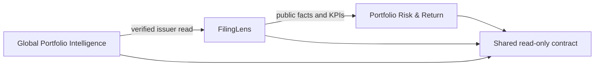

# Shared intelligence integration

## Dependency map and risk boundary



FilingLens is the financial-evidence authority. Global Portfolio Intelligence discovers and screens ideas; Portfolio Risk & Return owns holdings, risk, allocation, performance, and return attribution. The shared layer does not copy private filing uploads, create orders, infer CIK/CNPJ values from tickers, or publish unreviewed valuation outputs.

The main risks are issuer-identity drift, stale data, unofficial sources, cross-service token exposure, and incompatible schema changes. The implementation addresses them with exact jurisdiction-specific identifiers, consumer-side freshness rules, an official-domain allowlist, a dedicated server-only bearer token, strict schemas, versioned routes, bounded responses, and SHA-256 content verification.

## Architecture choice

| Candidate | Advantages | Drawbacks |
|---|---|---|
| Direct point-to-point calls | Fastest initial wiring | Duplicated contracts and brittle coupling |
| Shared database | Simple reads | Cross-project credentials and ownership ambiguity |
| Versioned read-only contract (selected) | One financial authority, least privilege, independently deployable consumers | Consumers need explicit issuer mappings and retry/freshness policy |

The selected design is a small contract-first integration, not a new agent or event platform. A message bus or write-side shared service should be considered only after measured alert/feedback volume requires asynchronous delivery.

## API

Capability discovery is public and discloses no secret:

```http
GET /api/integration/v1/capabilities
```

Financial evidence is server-to-server only:

```http
GET /api/integration/v1/issuers/{us|br}/{CIK|CNPJ}/financial-snapshot
Authorization: Bearer <FILINGLENS_READ_API_TOKEN>
Accept: application/json
```

The response schema is `filinglens-public-finance-v1`. US CIKs are returned as ten digits and Brazilian CNPJs as fourteen digits. Values remain in their reported unit and currency. Annual revenue growth is calculated only when two consecutive fiscal years have the same unit and currency and a non-zero comparison period. Otherwise the KPI is `null` with no lineage IDs.

Expected responses:

| Status | Meaning |
|---|---|
| `200` | Digest-verified public regulatory snapshot |
| `400` | Invalid jurisdiction or registry identifier |
| `401` | Missing or incorrect integration token |
| `404` | No supported public snapshot for this issuer |
| `503` | Integration disabled or store unavailable |

## Data ownership

| Data | Owner | Shared now |
|---|---|---|
| Watchlists and discovery profile | Global Portfolio Intelligence | No |
| SEC/CVM issuer identity and annual facts | FilingLens | Yes |
| Deterministic screening KPI and evidence lineage | FilingLens | Yes |
| Reviewed valuation output | FilingLens / analyst review | No; future explicit contract |
| Holdings, exposures, risk, return attribution | Portfolio Risk & Return | No |
| Themes, gaps, and monitoring feedback | Portfolio Risk & Return | Future versioned write contract |

## Railway configuration

1. Set the same randomly generated, minimum 32-character token as `FILINGLENS_READ_API_TOKEN` on FilingLens and each server-side consumer.
2. Set `FILINGLENS_API_URL` on consumers to the HTTPS FilingLens origin with a trailing slash.
3. Keep `FILINGLENS_READ_ENABLED=true` only after a live authenticated read succeeds.
4. Configure `FILINGLENS_ISSUER_MAP_JSON` from independently verified listing-to-CIK/CNPJ mappings. Unknown mappings must remain unknown.
5. Never place the token in browser code, logs, GitHub files, URLs, or client-visible environment variables.

## Verification gate

- Contract and API unit tests pass, including auth, identifier normalization, digest integrity, official-domain enforcement, and missing-data behavior.
- Type checking, lint, full unit suite, and production build pass.
- GitHub CI passes on the pull request.
- FilingLens capability discovery reports configured in production.
- A live authenticated Apple read returns the expected issuer identity and a digest accepted by the Global Portfolio Intelligence consumer.
- An unauthenticated read returns `401`; a zero or malformed identity returns `400`.
- Portfolio Risk consumes the same public financial snapshot and continues to own all portfolio calculations.

